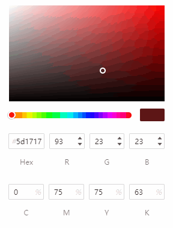

# ColorPicker 颜色选择器

## 特点

- 支持ts
- 支持RGB、CMYK色系输出。

## 外观



## 安装使用

### 安装

```shell
npm i @liyucan/color-picker
or
yarn add @liyucan/color-picker
```

### 使用

```js
import ColorPicker from '@liyucan/color-picker'; // 引入主文件
import '@liyucan/color-picker/lib/index.css'; // 引入样式文件

const instance = new ColorPicker({
    el: '#app', // 挂载节点，支持选择器和dom节点
    color: '#ae2626', // 初始色值，hex格式 
    // 获取接口，色值发生改变时触发此函数
    getColor: res => {
        console.log(res);
    }
});

// 因为使用了window对象监听鼠标事件，所以需要通过调用销毁方法卸载事件。
instance.destroy();
```

## 开发

### 安装依赖

```shell
npm install
or
yarn install
```

项目运行

```shell
npm run dev
or
yarn dev
```

项目构建

```shell
npm run build
or
yarn build
```
